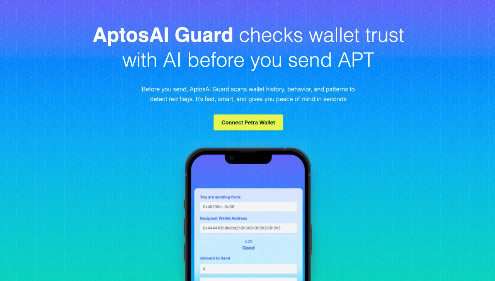
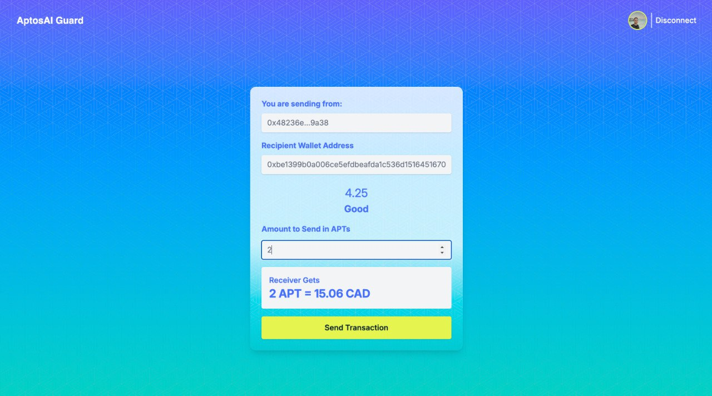

# AptosAI Guard

ML-backed wallet risk detector for Aptos transactions


## Overview

AptosAI Guard is a sophisticated wallet risk detection application that leverages machine learning to analyze and assess the risk level of Aptos blockchain transactions. The application consists of a Flask backend API and a React frontend interface, providing real-time risk scoring and transaction analysis.

## Loom Video Walkthrough

📽️ [Click to view walkthrough]([https://loom.com/your-video-link](https://www.loom.com/share/70af07d271cb42bf80975104da70d4d4?sid=d6c811cc-6f30-43ab-a0ff-4d266053a3c0)) 

## UI Screenshots

| Home Page | Risk Score Result |
|-----------|------------------|
|  |  |


## Features

- Real-time transaction risk scoring
- Machine learning-powered risk assessment
- User-friendly web interface built with modern React frontend
- Secure and modular Flask REST API
- Integration with Aptos blockchain
- Easily extendable architecture for future use cases

## Project Structure
```text
aptos-ai-guard/
├── backend/         # Flask API server
├── frontend/        # React web application
├── model/           # ML model and risk scoring logic
├── model_training/  # Training scripts and data
└── requirements.txt # Python dependencies
```

## Prerequisites

- Python 3.8+
- Node.js 14+
- npm or yarn
- Aptos CLI (optional, for development)

## Installation

1. Clone the repository:
```powershell
git clone https://github.com/nolandruid/aptos-ai-guard.git
cd aptos-ai-guard
```

2. Set up the backend:
For Windows (CMD or PowerShell):
```powershell
cd backend
python -m venv venv
source venv/Scripts/activate
pip install --upgrade pip
pip install -r requirements.txt
flask run
```

For Mac, Ubuntu, WSL:
```powershell
cd backend
make setup # Set up virtual environment and install dependencies
make start # Run the Flask development server
```

3. Set up the frontend:
```powershell
cd ../frontend
npm install  # or yarn install
npm run dev
```

## Running the Application

1. Start the backend server:
```powershell
cd backend
flask run
```

2. Start the frontend development server:
```powershell
cd ../frontend
npm start  # or yarn start
```

The application will be available at
- Frontend: http://localhost:3000
- Backend API: http://localhost:5000

## API Documentation

The backend API provides the following endpoints:

- POST /risk-score: Calculate the risk score for a given wallet address.
- Request Body:
  ```json
  {
    "wallet_address": "0x49fe344c4e0fcf3f90721b3c4b20c1a599f70348a0a772efe3933ff4d0578b9e"
  }
  ```
  
  Response:
  ```json
  {
    "confidence": 0.9,
    "label": "Trusted",
    "wallet_address": "0x49fe344c4e0fcf3f90721b3c4b20c1a599f70348a0a772efe3933ff4d0578b9e",
    "wallet_found": true
  }
  ```
- POST /aptos_to_cad: Convert Aptos (APT) amount to CAD using real-time pricing.
- Request Body:
  ```json
  {
    "amount": 4.5
  }
  ```

  Response:
  ```json
  {
    "amount": 4.5,
    "cad_value": 33.84
  }
  ```

## Contributing

1. Fork the repository
2. Create your feature branch (`git checkout -b feature/amazing-feature`)
3. Commit your changes (`git commit -m 'Add some amazing feature'`)
4. Push to the branch (`git push origin feature/amazing-feature`)
5. Open a Pull Request

## License

This project is licensed under the MIT License - see the LICENSE file for details.

## Acknowledgments

- Aptos Blockchain
- Flask Framework
- React
- scikit-learn
